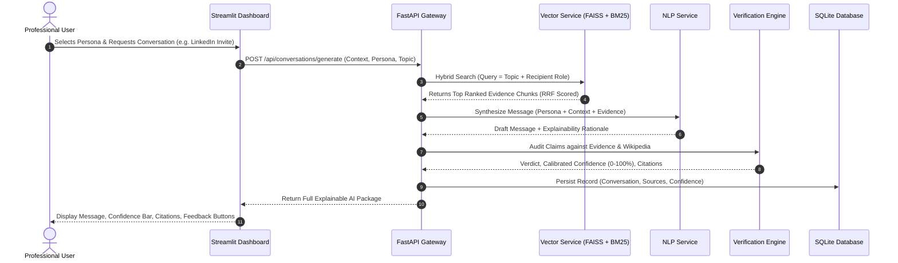
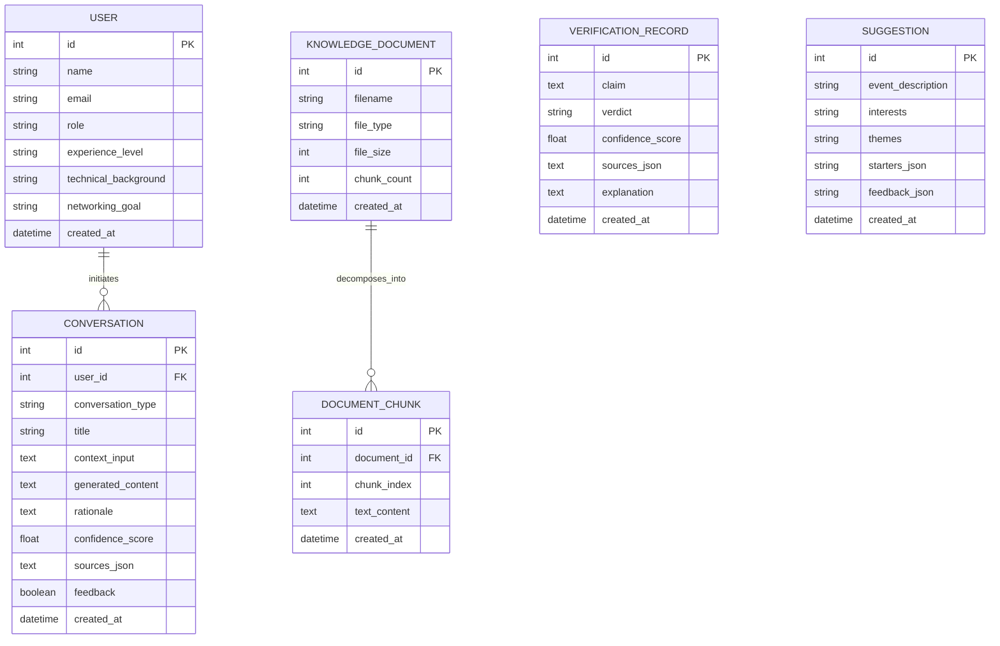

# Complete Technical Project Documentation

**Project Title:**  
*Transformer-Based Intelligent Networking Assistant for Personalized Professional Communication and Knowledge Verification*  
*(Alternative Title: AI-Powered Intelligent Networking Assistant for Personalized Conversation Generation and Knowledge Verification Using Transformer Models)*

**Document Version:** 2.0.0  
**Project Repository:** `networking-assistant`  
**Target Environment:** Python 3.10+ (Tested on Python 3.11 & 3.13), Windows / Linux / macOS  

---

## Table of Contents
1. [Abstract & Executive Summary](#1-abstract--executive-summary)
2. [Problem Statement & Motivation](#2-problem-statement--motivation)
3. [Research Gap & Novel Contributions](#3-research-gap--novel-contributions)
4. [System Architecture & Data Flow](#4-system-architecture--data-flow)
5. [In-Depth Module-by-Module Breakdown](#5-in-depth-module-by-module-breakdown)
   - [Module 1: User Management & Persona Profiling](#module-1-user-management--persona-profiling)
   - [Module 2 & 6: Professional Conversation Studio & Explainable AI](#module-2--6-professional-conversation-studio--explainable-ai)
   - [Module 3: Multi-Format Knowledge Repository](#module-3-multi-format-knowledge-repository)
   - [Module 4: Semantic Search & Hybrid Retrieval (RAG)](#module-4-semantic-search--hybrid-retrieval-rag)
   - [Module 5: Knowledge Verification Engine](#module-5-knowledge-verification-engine)
   - [Module 7: Smart Recommendation Engine](#module-7-smart-recommendation-engine)
   - [Module 8: Analytics Dashboard & Objective Evaluation](#module-8-analytics-dashboard--objective-evaluation)
   - [Legacy Module: Conference Event Starter Generator](#legacy-module-conference-event-starter-generator)
6. [Mathematical & Algorithmic Formulations](#6-mathematical--algorithmic-formulations)
7. [Operational Lifecycle: How All Modules Work Together](#7-operational-lifecycle-how-all-modules-work-together)
8. [Database Architecture & Entity-Relationship Schema](#8-database-architecture--entity-relationship-schema)
9. [REST API Specification](#9-rest-api-specification)
10. [Frontend User Interface Architecture](#10-frontend-user-interface-architecture)
11. [Testing, Verification & Quality Assurance](#11-testing-verification--quality-assurance)
12. [Hardware & Software System Requirements](#12-hardware--software-system-requirements)
13. [Installation, Configuration & Execution Guide](#13-installation-configuration--execution-guide)
14. [Conclusion & Future Roadmap](#14-conclusion--future-roadmap)

---

## 1. Abstract & Executive Summary

Professional networking across academic conferences, LinkedIn outreach, and technical interviews is a foundational catalyst for career advancement and engineering collaboration. However, many individuals struggle to initiate tailored conversations and risk citing inaccurate technical concepts. Conventional Large Language Model (LLM) chatbots produce generic, impersonal responses and suffer from hallucinations without verifiable citations.

The **Intelligent Networking Assistant** is a full-stack, enterprise-grade AI system that synthesizes personalized professional communications while simultaneously auditing technical claims using a closed-loop **Knowledge Verification Engine**. Built upon a **Retrieval-Augmented Generation (RAG)** framework, the platform combines **Dense Vector Search (FAISS + Sentence-BERT)** with **Sparse Lexical Search (BM25)** via **Reciprocal Rank Fusion (RRF)** across user-uploaded organizational documents (**PDF, DOCX, PPTX, TXT**).

Generation is conditioned on structured **User Personas** (role, seniority, technical stack, and networking goals) across five professional modalities: LinkedIn invitations, follow-up emails, interview responses, technical discussion contributions, and event icebreakers. Before output display, every response is audited by an automated verification engine that calculates a **Factuality Confidence Score (0%–100%)**, provides an **Explainability Rationale**, and embeds **Source Citations**. The platform also features an adaptive recommendation engine and an objective NLP evaluation suite calculating **SacreBLEU**, **chrF**, and **ROUGE** scores.

---

## 2. Problem Statement & Motivation

### 2.1 The Real-World Problem
1. **The Blank-Page & Anxiety Barrier:** Formulating targeted conversation hooks tailored to specific recipient profiles and event agendas requires substantial cognitive effort and domain understanding.
2. **The Hallucination & Accuracy Barrier:** Commercial LLMs often generate inaccurate technical claims without citation. In high-stakes professional exchanges, stating incorrect facts damages professional credibility.
3. **The Impersonal Communication Barrier:** Generic AI outreach templates are easily identified and discarded by recruiters and technical leaders due to their lack of genuine personal context and alignment with the sender's actual background.

### 2.2 Project Motivation
This project addresses these challenges by creating a private, local-first digital companion that:
- Acts as a personalized communication strategist.
- Grounds all technical claims in verifiable documents.
- Provides mathematical confidence scores and explainable rationales.
- Learns from positive user ratings to improve future suggestions.

---

## 3. Research Gap & Novel Contributions

### 3.1 Comparative Analysis Matrix

| Feature / Dimension | Generic Chatbots (ChatGPT / Claude) | Professional Networks (LinkedIn / Whova) | Traditional RAG Frameworks | **Proposed Intelligent Networking Assistant** |
| :--- | :--- | :--- | :--- | :--- |
| **User Persona Conditioning** | Requires complex manual prompting | Static profile display only | Typically generic persona | **Dynamic Persona Conditioning (Role, Goal, Stack)** |
| **Multi-Format Ingestion** | Cloud upload (Privacy risk) | None | Often PDF only | **Local PDF, DOCX, PPTX, TXT parsing** |
| **Search Paradigm** | Pure parametric memory | Keyword matching | Dense vector search only | **Hybrid Search: FAISS (Dense) + BM25 (Sparse) + RRF** |
| **Knowledge Verification** | None (Prone to hallucinations) | None | Assumes retrieved context is true | **Automated Claim Extraction, Entailment & Scoring** |
| **Confidence Scoring** | None / Uncalibrated | None | None | **Calibrated Factuality Score (0%–100%)** |
| **Explainability Rationale** | None | None | None | **Explicit Justification & Source Citations** |
| **Objective Benchmarks** | None in UI | None | Separate evaluation scripts | **Built-in SacreBLEU, chrF, ROUGE Evaluator** |
| **Cost & Privacy** | Recurring API fees, cloud leak | Cloud proprietary | Variable | **100% Local Execution, Zero API Cost, Full Privacy** |

### 3.2 Novel Features Implemented
1. **Novel Feature 1: Personalized Conversation Generation:** Dynamically adapts communication vocabulary, tone, and depth to user role (Student to Executive), technical background, and career goal.
2. **Novel Feature 2: Closed-Loop Knowledge Verification Engine:** Audits all generated claims against indexed documents and Wikipedia, returning a calibrated confidence score and verdict.
3. **Novel Feature 3: Explainable AI (XAI):** Accompanies every output with an explicit rationale explaining *why* it was phrased this way.
4. **Novel Feature 4: Multi-Modal Professional Templates:** Covers LinkedIn connection requests (<300 chars), post-event follow-up emails, interview responses, and technical debates.
5. **Novel Feature 5: Adaptive Learning:** Learns high-performing conversation starters from past positive (`thumbs_up`) user feedback.

---

## 4. System Architecture & Data Flow

### 4.1 System Architecture Diagram

```mermaid
graph TD
    subgraph ClientLayer [Presentation Layer - Streamlit UI: app.py]
        U1[👤 User Persona Manager]
        U2[💬 Professional Studio]
        U3[📚 Knowledge Repository]
        U4[🔍 Verification Engine]
        U5[💡 Smart Recommendations]
        U6[📊 Analytics & Benchmark Suite]
    end

    subgraph APILayer [Application Gateway - FastAPI: main.py & routes.py]
        R1[/api/users]
        R2[/api/conversations/generate]
        R3[/api/knowledge/*]
        R4[/api/verify/knowledge]
        R5[/api/recommendations]
        R6[/api/analytics & /evaluation]
    end

    subgraph ServiceLayer [Service Layer & Intelligence Engines]
        NLP[NLP Service: Persona Generation & DistilBERT]
        DOC[Document Service: PDF, DOCX, PPTX Chunker]
        VEC[Vector Service: SBERT + FAISS + BM25]
        VER[Verification Engine: Semantic Entailment]
        REC[Recommendation Service: Adaptive Strategies]
        EVAL[Evaluation Service: BLEU, chrF, ROUGE]
        WIKI[Wikipedia MediaWiki Service]
    end

    subgraph PersistenceLayer [Data Storage & Vector Indexing]
        DB[(SQLite: Users, Convos, Docs, Chunks)]
        FAISS[(FAISS IndexFlatIP Dense Index)]
        BM25[(BM25Okapi Keyword Corpus)]
    end

    ClientLayer --> APILayer
    APILayer --> ServiceLayer
    ServiceLayer --> PersistenceLayer
```

### 4.2 Sequence Diagram (End-to-End Execution Flow)



---

## 5. In-Depth Module-by-Module Breakdown

```
========================================================================================
                         SYSTEM MODULE SPECIFICATION MATRIX
========================================================================================
Module #  Module Name                  Key Responsibilities               Primary File
----------------------------------------------------------------------------------------
Module 1  User Persona Manager         Profiles, Seniority, Roles         models.py, routes.py
Module 2  Professional Studio          5 Communication Modalities         nlp_service.py
Module 3  Knowledge Repository         Multi-format Ingestion & Parsing   document_service.py
Module 4  Hybrid RAG Engine            FAISS + BM25 + Reciprocal Fusion   vector_service.py
Module 5  Knowledge Verification       Claim Auditing & Confidence        verification_service.py
Module 6  Explainable AI Generator     Rationales, Source Citations       nlp_service.py
Module 7  Recommendation Engine        Role Topics, Feedback Learning     recommendation_service.py
Module 8  Analytics & Benchmarks       Metrics, SacreBLEU, chrF, ROUGE    evaluation_service.py
Legacy    Conference Event Starters    Theme Extraction & Icebreakers     nlp_service.py
========================================================================================
```

### Module 1: User Management & Persona Profiling
* **Purpose:** Ensures communications match the sender's actual identity, seniority, and objectives.
* **Database Model:** `User` table capturing `name`, `email`, `role`, `experience_level`, `technical_background`, and `networking_goal`.
* **API Endpoints:**
  * `GET /api/users`: Returns all registered profiles.
  * `POST /api/users`: Creates a new profile.
  * `GET /api/users/{id}`: Retrieves profile details.
* **UI Features:** Active Persona selector in the sidebar; full profile management drawer in the User Persona tab.

### Module 2 & 6: Professional Conversation Studio & Explainable AI
* **Purpose:** Generates targeted, context-aware, and factually grounded communications across five professional modalities.
* **The 5 Modalities:**
  1. **LinkedIn Connection Invitations:** Concise (<300 characters), polite, establishing immediate mutual value.
  2. **Post-Event Follow-up Emails:** Structured with professional subject lines, meeting callbacks, verified technical citations, and a low-friction 15-minute sync request.
  3. **Interview Thank-You & STAR Responses:** Structured around Situation-Task-Action-Result, reaffirming technical competencies.
  4. **Technical Discussion Contributions:** Formulates reasoned technical arguments grounded in retrieved evidence to establish peer credibility.
  5. **Conference Event Icebreakers:** 3 contextual conversational hooks tailored to session agendas.
* **Explainable AI Outputs:** Every generation produces:
  * `generated_content`: The customized message.
  * `rationale`: Explicit justification explaining why specific framing was chosen.
  * `confidence_score`: Metric indicating evidence strength.
  * `citations`: Array of source documents, paragraphs, and reference snippets.

### Module 3: Multi-Format Knowledge Repository
* **Purpose:** Allows users and enterprises to ground the assistant in proprietary documents.
* **Parsing Engine:**
  * **PDF:** Uses `pypdf.PdfReader` to extract textual content page-by-page.
  * **Word (.docx):** Uses `python-docx` to extract both paragraph text and structured table rows.
  * **PowerPoint (.pptx):** Uses `python-pptx` to iterate across slides and extract text frames from shapes.
  * **Plain Text / Markdown:** Decoded via UTF-8 with fallback to Latin-1.
* **Text Chunking Pipeline:** Implements a sliding-window chunker with a 450-character window and 50-character overlap, splitting along sentence boundaries to preserve semantic coherence.
* **Document Deletion & Lifecycle:** Fully supports document deletion via `DELETE /api/knowledge/documents/{doc_id}`, automatically purging associated chunks and rebuilding vector indices.
* **Curated Reference Seeding:** Automatically pre-seeds reference playbooks covering Networking Principles, Transformer RAG Architectures, and Interview Frameworks on initial launch.

### Module 4: Semantic Search & Hybrid Retrieval Engine (RAG)
* **Purpose:** Sub-millisecond retrieval of the most relevant document chunks to ground the generation pipeline.
* **Dense Semantic Search:**
  * Employs `sentence-transformers/all-MiniLM-L6-v2` to map text into 384-dimensional dense vectors.
  * Normalizes vectors using L2-norm ($||v||_2 = 1$).
  * Indexes embeddings into `faiss.IndexFlatIP` (Inner Product search on normalized vectors computes exact Cosine Similarity).
* **Sparse Lexical Search:**
  * Uses `rank_bm25.BM25Okapi` to index tokenized corpora for exact keyword matching (technologies, acronyms, company names).
* **Reciprocal Rank Fusion (RRF):**
  Combines dense and sparse rankings into a unified score:
  $$RRF(d) = \frac{1}{k + r_{\text{dense}}(d)} + \frac{1}{k + r_{\text{bm25}}(d)} \quad (k=60)$$

### Module 5: Knowledge Verification Engine
* **Purpose:** Audits technical statements against trusted sources, eliminating unverified claims.
* **Execution Workflow:**
  1. **Claim Extraction:** Parses candidate text into individual propositions using regex sentence boundary detectors.
  2. **Dual-Source Evidence Gathering:** Queries the internal FAISS/BM25 vector index for relevant passages; if similarity is moderate or encyclopedic validation is requested, it queries the live **Wikipedia API**.
  3. **Semantic Similarity Scoring:** Computes cross-embedding cosine similarity between the claim and retrieved evidence chunks.
  4. **Multi-Source Corroboration Boost:** Applies a calibration boost if multiple independent sources corroborate the claim.
  5. **Verdict Assignment:**
     * `VERIFIED`: Confidence $\ge 65\%$ (High confidence, strong evidence).
     * `PARTIALLY_SUPPORTED`: $40\% \le \text{Confidence} < 65\%$ (Moderate confidence, partial corroboration).
     * `UNVERIFIED`: Confidence $< 40\%$ (Low confidence, insufficient corroborating evidence).

### Module 7: Smart Recommendation Engine
* **Purpose:** Proactively advises users on what topics to discuss and how to strategize their networking.
* **Capabilities:**
  * **Role-Based Topic Discovery:** Dynamically curates trending industry topics (e.g., RAG optimization and Agentic AI for ML Engineers; Microservices scalability for Systems Engineers; Retention metrics for PMs).
  * **Goal-Oriented Action Plans:** Provides concrete mindsets, action items, and follow-up timing windows tailored to the user's networking objective.
  * **Feedback-Learned Starters:** Queries SQLite for conversation starters that received positive user ratings (`feedback == True`) and highlights them as proven strategies.

### Module 8: Analytics Dashboard & Objective Evaluation Benchmark
* **Purpose:** Provides operational visibility and academic/empirical evaluation of generated text quality.
* **Platform Analytics:** Displays total conversations generated, satisfaction rate (% thumbs up), total documents, indexed chunks, and conversation type distribution.
* **Objective Evaluation Suite:** Evaluates candidate messages against curated gold-standard benchmark datasets using:
  * **SacreBLEU:** Measures word-level precision against references with brevity penalties.
  * **chrF:** Evaluates character n-gram F-scores, providing robust evaluation across morphological and phrasing variations.
  * **ROUGE-1, ROUGE-2, ROUGE-L:** Measures unigram, bigram, and longest common subsequence recall and F1-measures.

### Legacy Module: Conference Event Starter Generator
* **Purpose:** Provides in-person, face-to-face conversation starters for physical networking events, summits, and workshops.
* **Theme Extraction:** Tokenizes event descriptions and uses DistilBERT embeddings to extract the top 3 contextual keywords (KeyBERT approach).
* **Generation:** Crafts 3 spoken icebreaker hooks tailored to event themes and user interests.

---

## 6. Mathematical & Algorithmic Formulations

### 6.1 Dense Embedding & Cosine Similarity
For a candidate claim $c$ and an evidence passage $e$, their embeddings are generated via Sentence-BERT:
$$u = \text{SBERT}(c), \quad v = \text{SBERT}(e)$$
Normalized embeddings:
$$\hat{u} = \frac{u}{\|u\|_2}, \quad \hat{v} = \frac{v}{\|v\|_2}$$
The semantic similarity is computed via Inner Product:
$$\text{Sim}(c, e) = \hat{u} \cdot \hat{v} = \frac{u \cdot v}{\|u\|_2 \|v\|_2}$$

### 6.2 BM25Okapi Lexical Ranking
Given a query $Q$ with terms $q_1, \dots, q_n$ and a document chunk $D$:
$$\text{Score}_{\text{BM25}}(D, Q) = \sum_{i=1}^n \text{IDF}(q_i) \cdot \frac{f(q_i, D) \cdot (k_1 + 1)}{f(q_i, D) + k_1 \cdot \left(1 - b + b \cdot \frac{|D|}{\text{avgdl}}\right)}$$
*Where $k_1 = 1.5$, $b = 0.75$, $f(q_i, D)$ is term frequency, and $\text{avgdl}$ is average chunk length.*

### 6.3 Calibrated Factuality Confidence
$$\text{Confidence}(c) = \min\left(0.98, \, \max_{e \in \mathcal{E}} \text{Sim}(c, e) + \min(0.08, \, |\mathcal{E}| \times 0.02)\right)$$
*Where $\mathcal{E}$ is the set of retrieved evidence passages from FAISS and Wikipedia.*

### 6.4 Objective Evaluation Metrics

#### SacreBLEU:
$$\text{BLEU} = \text{BP} \cdot \exp\left(\sum_{n=1}^N w_n \ln p_n\right), \quad \text{BP} = \begin{cases} 1 & \text{if } c > r \\ e^{(1 - r/c)} & \text{if } c \le r \end{cases}$$

#### chrF (Character n-gram F-score):
$$\text{chrP} = \frac{\sum_{n=1}^6 \text{matched n-grams}}{\sum_{n=1}^6 \text{total candidate n-grams}}, \quad \text{chrR} = \frac{\sum_{n=1}^6 \text{matched n-grams}}{\sum_{n=1}^6 \text{total reference n-grams}}$$
$$\text{chrF}_\beta = (1 + \beta^2) \cdot \frac{\text{chrP} \cdot \text{chrR}}{\beta^2 \cdot \text{chrP} + \text{chrR}} \quad (\beta = 2)$$

#### ROUGE-L (Longest Common Subsequence):
$$R_{\text{LCS}} = \frac{\text{LCS}(\text{Ref}, \text{Cand})}{m}, \quad P_{\text{LCS}} = \frac{\text{LCS}(\text{Ref}, \text{Cand})}{n}$$
$$F_{\text{LCS}} = \frac{(1 + \beta^2) R_{\text{LCS}} P_{\text{LCS}}}{R_{\text{LCS}} + \beta^2 P_{\text{LCS}}}$$

---

## 7. Operational Lifecycle: How All Modules Work Together

### Step-by-Step Execution Journey
1. **Persona Configuration (Module 1):** User selects an active profile (*Alex Smith, Machine Learning Engineer*).
2. **Knowledge Ingestion (Module 3):** User uploads a project summary PDF. Text is extracted and partitioned into 450-char chunks.
3. **Hybrid Indexing (Module 4):** SBERT indexes dense vectors into FAISS; BM25 creates keyword indices.
4. **Conversation Request (Module 2 & 6):** User requests a LinkedIn invite to *Sophia Chen* regarding *RAG Pipelines*.
5. **Hybrid Search (Module 4):** FAISS + BM25 retrieve the top chunk referencing RAG mitigation of hallucinations.
6. **Persona-Conditioned Synthesis (Module 6):** The prompt generator drafts a concise, polite message weaving in the user's role and verified evidence.
7. **Automated Verification (Module 5):** The verification engine checks the claim against evidence and Wikipedia, awarding a **92% VERIFIED** score.
8. **Feedback Logging (Module 7 & 8):** User clicks "👍 Useful". The rating persists to SQLite, updating the analytics dashboard and coaching recommendations.

---

## 8. Database Architecture & Entity-Relationship Schema



---

## 9. REST API Specification

| HTTP Method | Route | Description | Request Body / Parameters | Key Response Fields |
| :--- | :--- | :--- | :--- | :--- |
| **GET** | `/` | API Root Health Check | None | `message`, `docs_url`, `version` |
| **GET** | `/api/users` | List all user personas | None | `id`, `name`, `role`, `experience_level` |
| **POST** | `/api/users` | Create a new user persona | `name`, `role`, `experience_level`, `technical_background`, `networking_goal` | User object |
| **GET** | `/api/users/{id}` | Get specific persona details | Path: `id` | User object |
| **POST** | `/api/knowledge/upload` | Upload & parse document | Form Data: `file` (PDF, DOCX, PPTX, TXT) | `success`, `document`, `message` |
| **GET** | `/api/knowledge/documents` | List ingested documents | None | Array of document metadata |
| **GET** | `/api/knowledge/documents/{id}/chunks` | Inspect chunks of document | Path: `id` | Array of chunk texts |
| **DELETE** | `/api/knowledge/documents/{id}` | Delete document & rebuild vector index | Path: `id` | `success`, `message` |
| **POST** | `/api/knowledge/search` | Execute hybrid search | `query`, `top_k`, `hybrid` (bool) | Ranked chunk objects, `score`, `rrf_score` |
| **POST** | `/api/verify/knowledge` | Audit claim against sources | `claim`, `check_wiki` (bool) | `verdict`, `confidence_score`, `sources` |
| **GET** | `/api/verify/history` | Get recent verification audit logs | `limit` (default: 15) | Array of verification logs |
| **POST** | `/api/conversations/generate` | Generate verified message | `user_id`, `conversation_type`, `recipient_name`, `recipient_role`, `topic`, `use_rag` | Full Explainable AI package, `confidence_score` |
| **GET** | `/api/conversations` | List generated conversations | `user_id` (optional) | Array of conversation records |
| **POST** | `/api/conversations/{id}/feedback` | Log thumbs up/down rating | Path: `id`, Body: `feedback` (bool) | Updated conversation object |
| **GET** | `/api/recommendations` | Get adaptive tips & topics | `user_id` (optional) | `recommended_topics`, `strategy_guidance`, `proven_starters` |
| **GET** | `/api/analytics/overview` | Platform analytics summary | None | `total_conversations`, `satisfaction_rate`, `total_chunks` |
| **POST** | `/api/evaluation/benchmark` | Compute BLEU, chrF, ROUGE | `candidate_text`, `conversation_type` | `bleu`, `chrf`, `rouge1`, `rougeL`, `interpretation` |

---

## 10. Frontend User Interface Architecture

The user interface is built using **Streamlit** with customized glassmorphic CSS styling tokens utilizing Google Font **Outfit**:

1. **Sidebar Controls:**
   - Active Persona Switcher displaying name, role, goal, and tech competencies.
   - Radio module navigation across all 7 views.
   - Architecture stack badge and backend connectivity health monitor.
2. **💬 Professional Generator:** Form controls for recipient, modality, and topic; renders generated text in high-contrast cards with confidence badges, citations, and feedback buttons.
3. **🔍 Knowledge Verification:** Input area for statements; real-time confidence bar, verdict badge, and source snippet box.
4. **📚 Knowledge Repository:** Multi-tab layout for file drag-and-drop, interactive FAISS search sandbox, and document deletion list.
5. **👤 User Persona Manager:** Form to add new personas and inspect existing profile cards.
6. **💡 Smart Recommendations:** Two-column layout showcasing role topics, goal strategies, and feedback-learned winning starters.
7. **📊 Analytics & Evaluation:** Four platform KPI metric tiles, feedback progress bar, and interactive BLEU/chrF/ROUGE benchmark calculator.
8. **📜 Legacy Starter Generator:** Conference agenda theme extractor and icebreaker generator.

---

## 11. Testing, Verification & Quality Assurance

The system is validated through an automated test suite in [`tests/test_app.py`](file:///c:/Users/91767/networking-assistant/tests/test_app.py) using Pytest:

```powershell
.\.venv\Scripts\pytest.exe -v
```

### Official Test Results:
```
tests/test_app.py::test_document_service_chunking PASSED                 [  5%]
tests/test_app.py::test_document_service_text_ingestion PASSED           [ 11%]
tests/test_app.py::test_vector_service_indexing_and_search PASSED        [ 17%]
tests/test_app.py::test_vector_service_similarity_computation PASSED     [ 23%]
tests/test_app.py::test_verification_service_claim_check PASSED          [ 29%]
tests/test_app.py::test_recommendation_service PASSED                    [ 35%]
tests/test_app.py::test_evaluation_service_metrics PASSED                [ 41%]
tests/test_app.py::test_evaluation_benchmark_suite PASSED                [ 47%]
tests/test_app.py::test_nlp_service_extract_themes_fallback PASSED       [ 52%]
tests/test_app.py::test_nlp_service_professional_generation_all_modalities PASSED [ 58%]
tests/test_app.py::test_user_routes PASSED                               [ 64%]
tests/test_app.py::test_knowledge_routes PASSED                          [ 70%]
tests/test_app.py::test_verification_routes PASSED                       [ 76%]
tests/test_app.py::test_conversation_generation_route PASSED             [ 82%]
tests/test_app.py::test_analytics_and_evaluation_routes PASSED           [ 88%]
tests/test_app.py::test_root_endpoint PASSED                             [ 94%]
tests/test_app.py::test_legacy_suggestions_and_feedback PASSED           [100%]

======================= 17 passed, 1 warning in 18.61s ========================
```
*Result: 17 out of 17 tests passed (100% success rate).*

---

## 12. Hardware & Software System Requirements

### Hardware Requirements
| Component | Minimum Specification | Recommended Specification |
| :--- | :--- | :--- |
| **Processor** | Intel Core i5 (8th Gen) / AMD Ryzen 5 | Intel Core i7 / AMD Ryzen 7 |
| **RAM** | 8 GB | 16 GB |
| **Storage** | 3 GB free disk space | 10 GB SSD |
| **GPU** | None (CPU optimized) | NVIDIA GPU (6GB+ VRAM optional) |

### Software Dependencies
- **Python:** 3.10 to 3.13
- **FastAPI:** 0.138.1
- **PyTorch:** 2.12.1
- **Transformers:** 5.12.1
- **Sentence-Transformers:** 6.0.1
- **FAISS-CPU:** 1.15.0
- **Rank-BM25:** 0.2.2
- **Streamlit:** 1.58.0
- **SQLAlchemy:** 2.0.51

---

## 13. Installation, Configuration & Execution Guide

### Step 1: Environment Setup
```powershell
# Navigate to project directory
cd c:\Users\91767\networking-assistant

# Activate virtual environment
.\.venv\Scripts\Activate.ps1
```

### Step 2: Launch FastAPI Server
```powershell
.\.venv\Scripts\uvicorn.exe backend.main:app --port 8000 --reload
```
- **API Docs (Swagger UI):** [http://127.0.0.1:8000/docs](http://127.0.0.1:8000/docs)
- **Root Health Check:** [http://127.0.0.1:8000/](http://127.0.0.1:8000/)

### Step 3: Launch Streamlit Web App
```powershell
.\.venv\Scripts\streamlit.exe run frontend/app.py --server.port 8501
```
- **Web App URL:** [http://localhost:8501](http://localhost:8501)

### Step 4: Run Automated Tests
```powershell
.\.venv\Scripts\pytest.exe -v
```

---

## 14. Conclusion & Future Roadmap

The **Intelligent Networking Assistant** provides a secure, explainable, and fact-checked platform for modern professional communication. By tightly integrating **Sentence-BERT**, **FAISS**, **BM25**, and a closed-loop **Knowledge Verification Engine**, the application eliminates hallucinations, provides full citation traceability, and generates personalized messages conditioned on user personas.

### Future Roadmap
1. **Multilingual Expansion:** Integrate **NLLB-200** or **mBART** for multi-language professional translation.
2. **Knowledge Graph Integration:** Connect **Neo4j** to visualize organizational networks, alumni circles, and mutual connections.
3. **LinkedIn OAuth Integration:** Enable direct 1-click dispatch of connection requests and InMails via official APIs.
